Vi har i fællesskab fået udarbejdet en velfungerende løsning af vores prototype
Gruppe 8 
Kübra, Anna, Mathilde og Frederikke 

# Delaflevering 2 – Sustainable Web

I denne version arbejder jeg videre med den tidligere udviklede webapp for Spilcaféen. 
Ud fra resultaterne fra min audit i delaflevering 1 optimerer jeg løbende løsningen med fokus på bæredygtighed, webtilgængelighed, responsivt design og forretningspotentiale.

## Arbejdsproces

Jeg arbejder med én ændring ad gangen, så jeg kan teste løsningen løbende og se, hvilken effekt de enkelte ændringer har. Ændringerne bliver løbende dokumenteret gennem GitHub commits.

---

## Kodeoprydning og struktur

### Opdeling af CSS

Bookingens styling lå tidligere sammen med resten af sidens styling i `app.css`.

Jeg har flyttet den styling, der kun hører til bookingflowet, over i en separat `booking.css`.

Formålet var at:
- gøre CSS-koden mere overskuelig
- samle bookingens styling ét sted
- gøre det lettere at finde og ændre kode senere

Der er ikke ændret på designet eller funktionaliteten i forbindelse med denne ændring. Siden blev testet efter opdelingen for at sikre, at den fortsat så ud som før.

### Opdeling af JavaScript

Bookingfunktionen lå tidligere sammen med resten af funktionaliteten i `app.js`.

Jeg har flyttet bookingflowet over i en separat `booking.js`, mens den øvrige funktionalitet fortsat ligger i `app.js`.

`openBooking()` og `closeBooking()` er gjort tilgængelige via `window`, så de fortsat kan bruges fra `app.js`.

Jeg har samtidig fjernet bookingens afhængighed af `els.tabRes` og `updateBackIcon()`.

Formålet var at:
- gøre JavaScript-koden mere overskuelig
- samle bookingfunktionaliteten ét sted
- gøre koden lettere at vedligeholde og arbejde videre med

Efter ændringen testede jeg hele bookingflowet fra valg af café til afsluttet booking. Funktionen virkede fortsat som før.

---

## Kommende optimeringer

Her dokumenterer jeg løbende de næste ændringer og resultater fra mine tests.

## Billedoptimering

### Førmåling

Inden billedoptimeringen blev der udført en Lighthouse Performance-test på mobil for at have et udgangspunkt, som resultatet efter optimeringen kan sammenlignes med.

Testen viste:
- Performance: 76
- First Contentful Paint (FCP): 0,9 sek.
- Largest Contentful Paint (LCP): 5,1 sek.
- Total Blocking Time (TBT): 0 ms
- Cumulative Layout Shift (CLS): 0,133
- Samlet network payload: 7.424 KiB

Lighthouse viste desuden et optimeringspotentiale under "Improve image delivery" med en estimeret besparelse på 2.788 KiB.

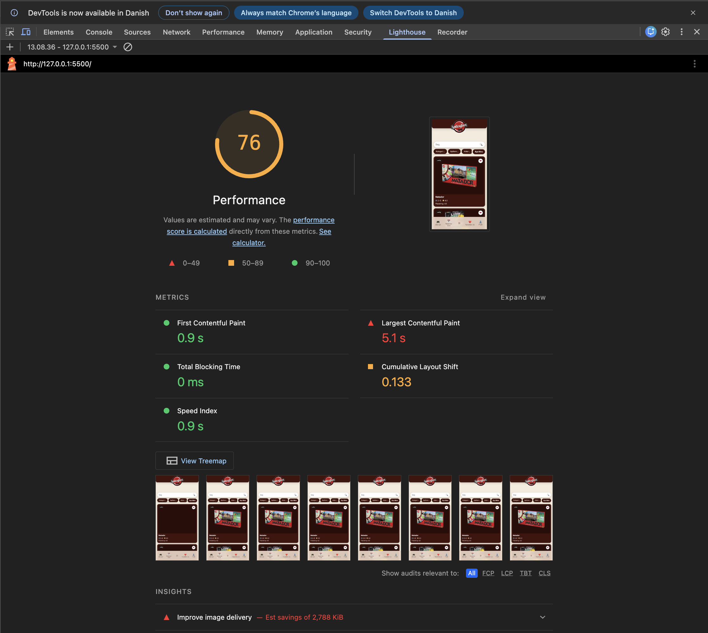

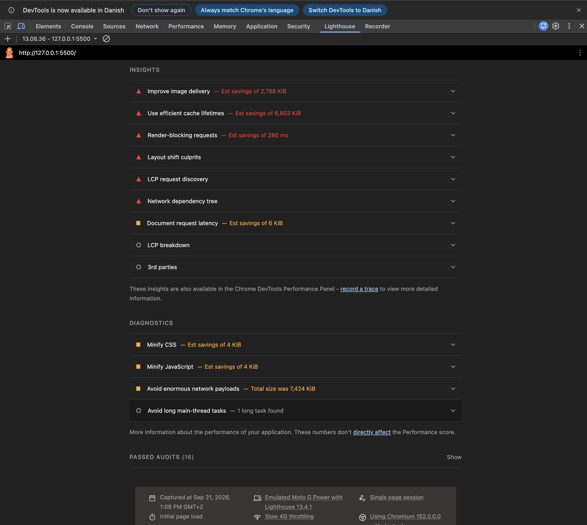

På baggrund af målingen optimeres billederne, hvorefter den samme Lighthouse-test udføres igen for at undersøge effekten.

### Flytning af spilbilleder

I den oprindelige løsning blev spilbillederne hentet fra en ekstern GitHub-kilde. I forbindelse med billedoptimeringen har jeg flyttet billederne til projektets egen `images/games`-mappe og ændret JavaScript-koden, så appen anvender de lokale filer.

Billederne flyttes allerede på dette tidspunkt, fordi de efterfølgende skal optimeres i forhold til blandt andet dimensioner og filstørrelse. Det giver mulighed for at arbejde direkte med billedfilerne i projektet og undgår, at de senere skal flyttes igen.

Flytningen hænger samtidig sammen med en anbefaling fra auditten om at flytte spilbillederne til projektets egen hosting som en del af arbejdet med caching. Selve caching-optimeringen behandles dog først senere.

Efter ændringen kontrollerede jeg i DevTools, at spilbillederne blev hentet fra projektets lokale mappe. Herefter blev Lighthouse Performance-testen gentaget.

Resultatet efter ændringen:
- Performance: 73
- First Contentful Paint (FCP): 0,9 sek.
- Largest Contentful Paint (LCP): 6,1 sek.
- Total Blocking Time (TBT): 0 ms
- Cumulative Layout Shift (CLS): 0,133
- Speed Index: 0,9 sek.
- Estimeret besparelse under "Improve image delivery": 2.788 KiB

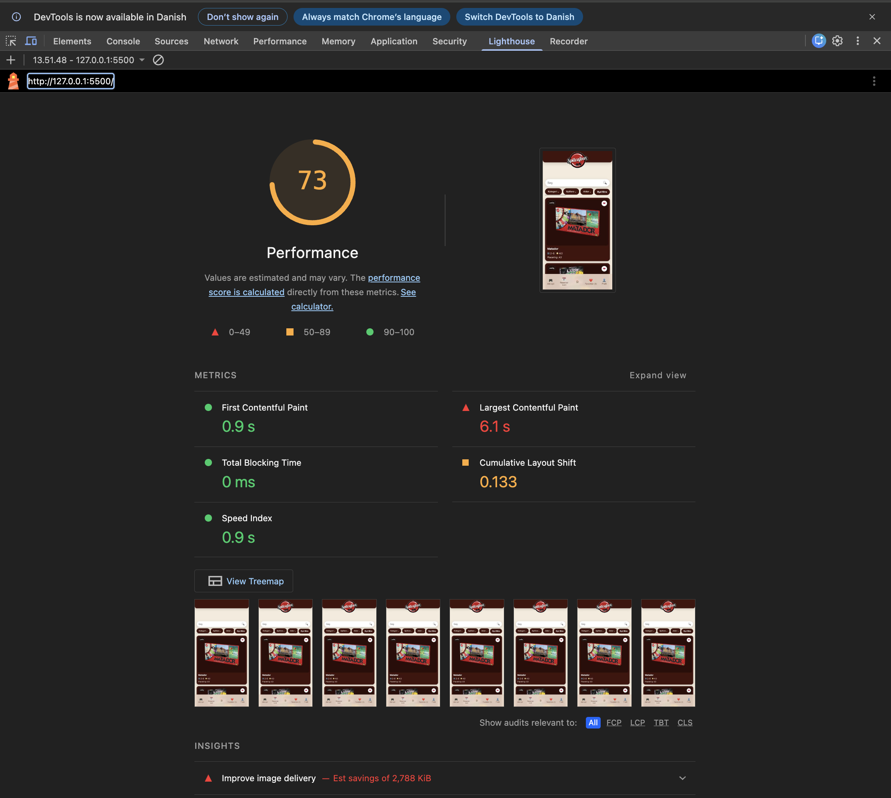

Målingen viser fortsat et optimeringspotentiale for billederne. Næste trin er derfor at optimere billedernes dimensioner og filstørrelse.

### Optimering af billedstørrelser

Efter spilbillederne var flyttet lokalt, blev deres dimensioner undersøgt. Flere af billederne var over 1000 px, selvom de bliver vist væsentligt mindre på siden.

Billederne var allerede i WebP-format, så det var ikke nødvendigt at konvertere dem. I stedet har jeg reduceret de billeder, der var større end 800 px, til maksimalt 800 px. Billederne er gemt med en kvalitet på 80 % for at reducere filstørrelsen uden at forringe kvaliteten for meget.

Efter ændringen blev Lighthouse-testen gentaget. Her viste "Improve image delivery" en estimeret besparelse på 791 KiB. Det er en tydelig reduktion sammenlignet med førmålingen, hvor den estimerede besparelse var 2.788 KiB.

Performance-scoren blev dog ikke forbedret og lå efter ændringen på 71. Selvom billedoptimeringen har reduceret den estimerede besparelse under "Improve image delivery", kan der altså endnu ikke ses en forbedring i den samlede Performance-score. Performance påvirkes også af andre forhold på siden, som undersøges senere.

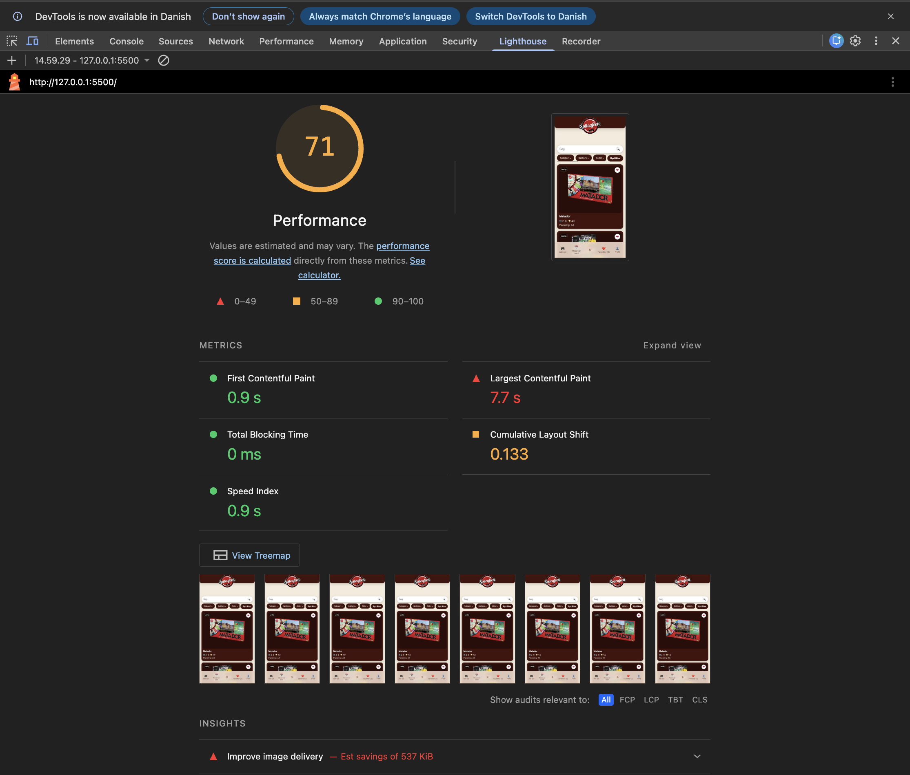

### Optimering af logo

Lighthouse viste efterfølgende, at logoet stadig havde et stort optimeringspotentiale. Logoet blev hentet fra en ekstern Squarespace-adresse og havde oprindeligt dimensionerne 2500 × 1892 px.

Jeg har derfor flyttet logoet til projektets egen `images`-mappe, reduceret dimensionerne og gemt det som WebP. Logoet blev efterfølgende komprimeret fra ca. 68 KB til 17 KB.

Efter optimeringen blev Lighthouse-testen gentaget. "Improve image delivery" blev reduceret fra 588 KiB til 537 KiB, og logoet fremgår ikke længere som et billede med optimeringspotentiale.

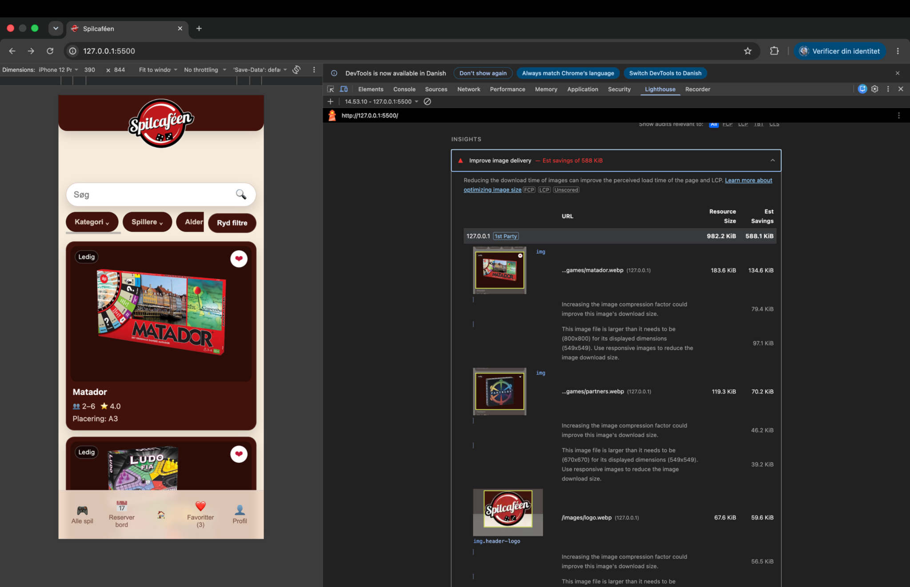
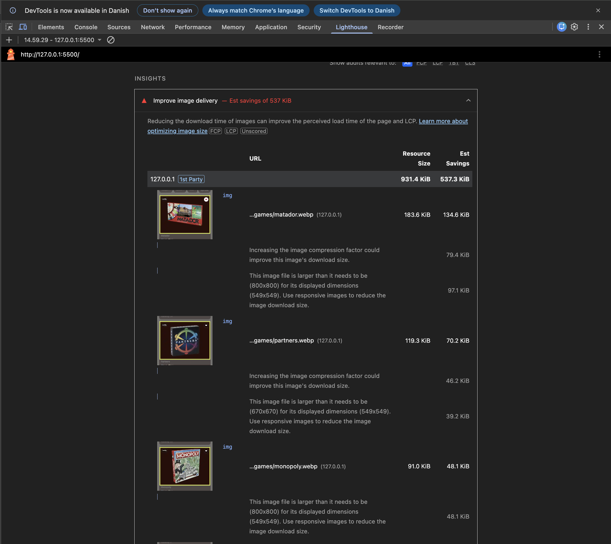

Der er stadig et optimeringspotentiale på 537 KiB for spilbillederne. Lighthouse viser blandt andet, at nogle af billederne bliver hentet i større dimensioner, end de bliver vist i. Derfor undersøges responsive billeder som næste del af billedoptimeringen.


Som en del af optimeringen blev billeder over 800 px reduceret til maksimalt 800 px. Tabellen viser eksempler på, hvordan dette har påvirket billedernes dimensioner og filstørrelse:

| Billede | Før dimensioner | Efter dimensioner | Før filstørrelse | Efter filstørrelse |
|---|---:|---:|---:|---:|
| Catan | 1533 × 1533 px | 800 × 800 px | 525 KB | 64,6 KB |
| Cluedo | 1122 × 1122 px | 800 × 800 px | 380 KB | 84,6 KB |
| Exploding Kittens | 1116 × 1116 px | 800 × 800 px | 300 KB | 47,8 KB |
| Carcassonne | 1069 × 1068 px | 800 × 800 px | 259 KB | 58,0 KB |
| Azul | 1000 × 1000 px | 800 × 800 px | 312 KB | 84,1 KB |


### Responsive spilbilleder

Efter den første billedoptimering viste Lighthouse fortsat, at flere af spilbillederne var større end nødvendigt i forhold til den størrelse, de blev vist i. Samtidig havde jeg i den tidligere audit fundet, at spiloversigten på mobil med fordel kunne vises i to kolonner i stedet for én. Jeg ændrede derfor layoutet til to kolonner på mindre skærme.

Jeg testede efterfølgende layoutet manuelt ved forskellige skærmbredder. Ved 390 px vises spilkortene i to kolonner, så der kan vises flere spil på skærmen ad gangen.

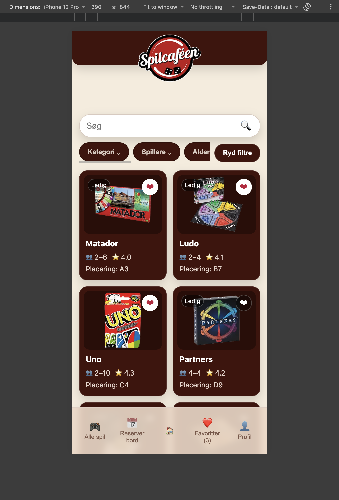

*Manuel test af spiloversigten ved en skærmbredde på 390 px.*

Layoutet blev også testet ved 320 px for at undersøge, om de to kolonner fortsat fungerede på en mindre skærm. Her bevares de to kolonner, og billederne tilpasser sig fortsat kortenes størrelse.

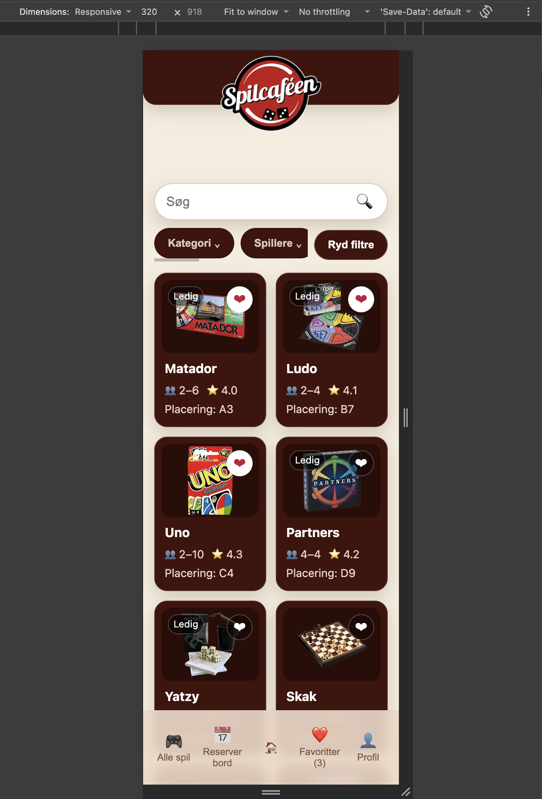

*Manuel test ved 320 px, hvor spilkortene fortsat vises i to kolonner.*

Lighthouse viste, at spilbillederne blev vist i forskellige størrelser afhængigt af skærmstørrelsen. På mobil blev billederne vist omkring 252 × 252 px, mens de på større skærme blev vist omkring 403 × 403 px. Jeg lavede derfor to versioner af hvert spilbillede på ca. 252 × 252 px og 403 × 403 px.

I koden anvendes `<picture>` med et breakpoint ved 600 px, så den mindre billedfil indlæses på små skærme, mens den større version bruges på større skærme. På den måde tilpasses både layoutet og den indlæste billedfil til skærmstørrelsen.

Filnavnet til billederne dannes dynamisk ud fra det oprindelige billednavn:

```js
const imageName = g.image.split("/").pop();
const imageBase = imageName.replace(".webp", "");
```

Herefter bruges `imageBase` i `<picture>`, så den samme løsning automatisk kan bruges på alle spilkort:

```html
<picture>
  <source
    media="(max-width: 600px)"
    srcset="images/games/${imageBase}-200.webp"
  >
  
</picture>
```

På skærme op til 600 px indlæses `-200.webp`-versionen, mens `-400.webp`-versionen bruges på større skærme. Filnavnene bruges til at skelne mellem de to versioner, mens billedernes faktiske dimensioner er ca. 252 × 252 px og 403 × 403 px.

Efter ændringen blev Lighthouse-testen gentaget. Det estimerede optimeringspotentiale under "Improve image delivery" blev reduceret fra 791 KiB efter den tidligere billedoptimering til 81 KiB.

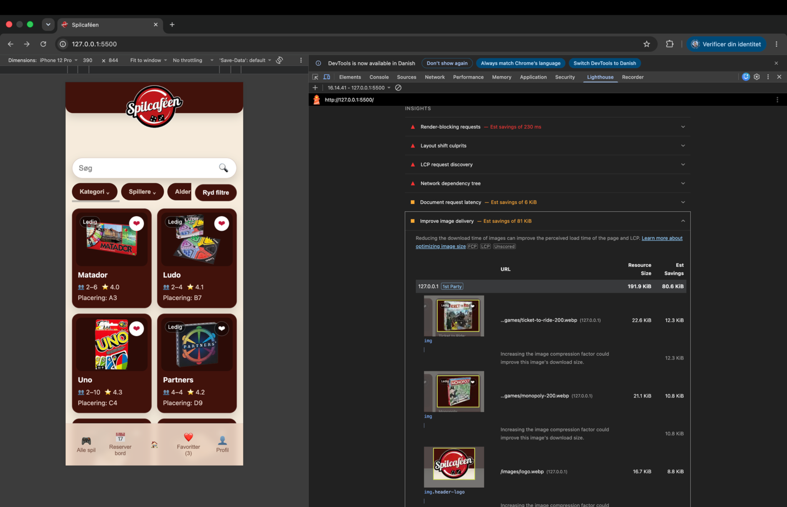

*Efter implementeringen af responsive billeder er det estimerede optimeringspotentiale reduceret til 81 KiB. De resterende forslag handler primært om yderligere komprimering.*

De resterende forslag fra Lighthouse handler ikke længere om, at spilbilledernes dimensioner er for store, men primært om yderligere komprimering. Jeg har valgt ikke at komprimere billederne yderligere på nuværende tidspunkt, da jeg også ønsker at bevare en passende billedkvalitet.

Den samlede Performance-score blev også målt igen på mobil. I den oprindelige førmåling var scoren 76, mens den efter billedoptimeringerne blev målt til 80. Billedoptimeringen har dermed bidraget til en forbedret performance, da der nu indlæses væsentligt mindre billeddata. Samtidig blev optimeringspotentialet under "Improve image delivery" reduceret fra 2.788 KiB i den oprindelige måling til 81 KiB. Lighthouse-resultater kan variere mellem målinger, og derfor bruges scoren sammen med de konkrete målinger af billeddata til at vurdere effekten.

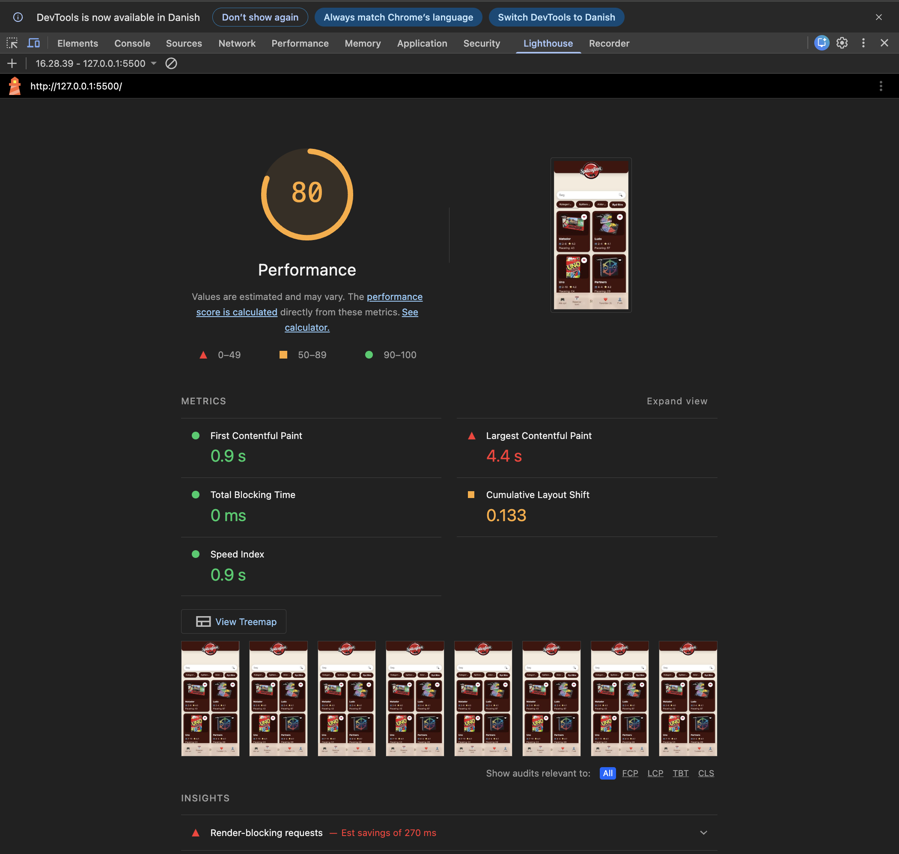

*Mobilmåling efter optimeringerne med en Performance-score på 80.*


### Tydelig fokusmarkering

Keyboard-testen fra delaflevering 1 viste, at det flere steder var uklart, hvilket element der havde fokus ved tastaturnavigation. Det gjaldt blandt andet søgefeltet, sorteringsknapperne og bundnavigationen.

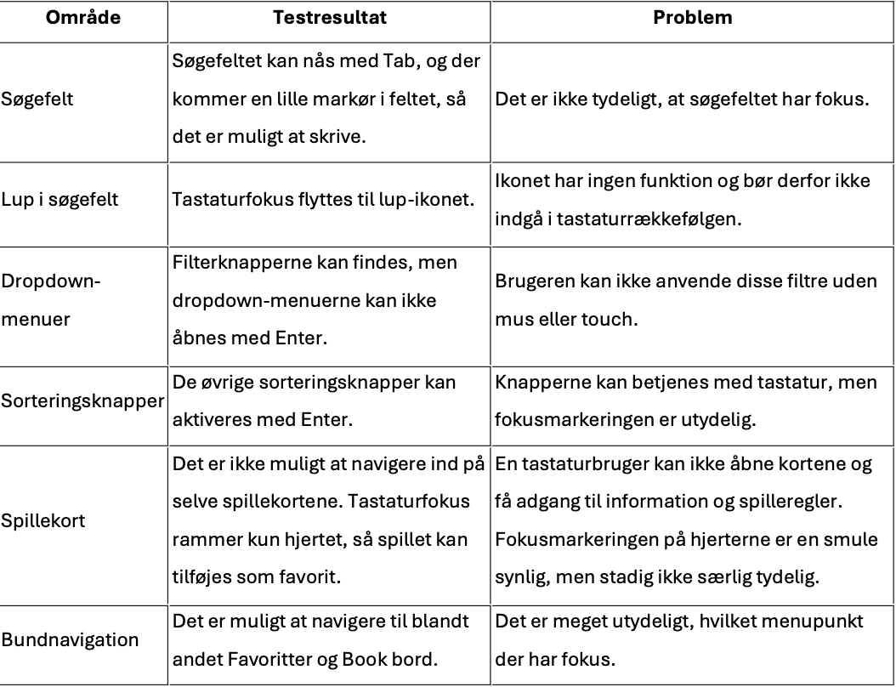

*Figur: Keyboard-test fra delaflevering 1, som viser problemer med blandt andet manglende eller utydelig fokusmarkering.*

#### Optimering

For at gøre det tydeligere, hvor brugeren befinder sig ved navigation med tastatur, er der tilføjet en ensartet rød, stiplet fokusmarkering på interaktive elementer.

Søgefeltet får fokusmarkering omkring hele søgeboksen, mens knapper og andre interaktive elementer får markeringen omkring selve elementet.

Fokusmarkeringen er testet med både Tab og Shift + Tab.

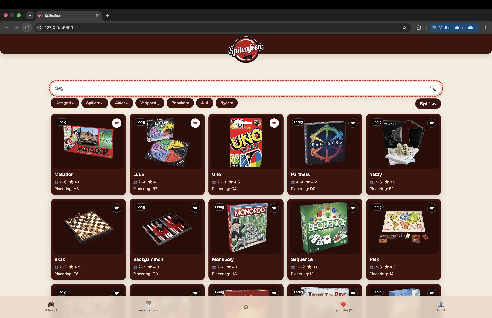

*Figur: Den nye fokusmarkering omkring søgefeltet ved tastaturnavigation.*

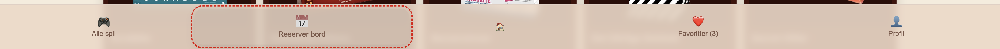

*Figur: Den nye fokusmarkering i bundnavigationen ved tastaturnavigation.*

#### Filter- og sorteringsområdet

Ved test af den nye fokusmarkering blev det observeret, at dele af markeringen omkring filterknapperne blev skjult, fordi knapperne lå tæt sammen.

Sortering og filtrering blev samtidig adskilt tydeligere. De tre tidligere sorteringsknapper blev samlet i én "Sorter efter"-dropdown, som blev placeret ved siden af "Ryd filtre". Afstanden og luften omkring knapperne blev desuden øget, så fokusmarkeringen ikke længere bliver skjult.

Efter ændringerne blev området igen testet med Tab og Shift + Tab. Fokusmarkeringen er nu tydelig på både filterknapperne, "Sorter efter" og "Ryd filtre".

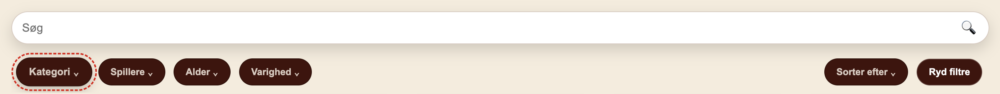

*Figur: Fokusmarkering på filter- og sorteringsområdet efter ændringen af strukturen.*

#### Videre test

Spillekortene kan på nuværende tidspunkt ikke modtage tastaturfokus. Dette var også et fund i den oprindelige keyboard-test og optimeres derfor separat.

Når de resterende problemer med tastaturbetjening er optimeret, gentages keyboard-testen fra delaflevering 1. Resultatet bruges til at sammenligne tastaturbetjeningen før og efter optimeringen.

### Søgefelt og lup-ikon

Keyboard-testen fra delaflevering 1 viste, at lup-ikonet i søgefeltet kunne modtage tastaturfokus, selvom det ikke havde nogen funktion. Det gav et unødvendigt stop ved navigation med Tab.

Lup-ikonet var opbygget som en knap, men er nu ændret til et dekorativt element, så det ikke længere indgår i Tab-rækkefølgen. Ikonet er samtidig udskiftet med et mørkt PNG-ikon.

```html
<div class="searchbar">
      <input type="text" id="search-input" placeholder="Søg" />
        <span class="icon-btn" aria-hidden="true">
          
        </span>
    </div>
```

Efter ændringen er søgefeltet testet med tastatur, hvor fokus nu går direkte videre fra søgefeltet til næste interaktive element. WAVE registrerer heller ikke længere en kontrastfejl på lup-ikonet.

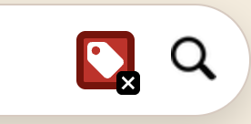

*Figur: WAVE efter ændringen af lup-ikonet, hvor der ikke længere registreres en kontrastfejl ved ikonet.*

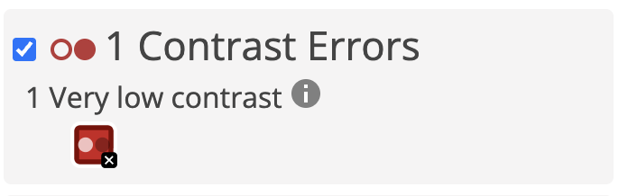

*Figur: WAVE registrerer efter ændringen én kontrastfejl på siden mod tidligere to.*

### Tastaturbetjening af spillekort og modal

Keyboard-testen fra delaflevering 1 viste, at spillekortene ikke kunne modtage fokus eller åbnes med tastatur. Det betød, at en bruger, der navigerer med tastatur, ikke kunne åbne spillene og få adgang til informationerne i modalvinduet.

#### Optimering

Spillekortene er gjort fokusérbare ved hjælp af `tabindex="0"`. Der er samtidig tilføjet en keyboard-event i JavaScript, så et kort kan åbnes med Enter, når selve kortet har fokus.

Favoritknappen ligger inde i spillekortet og kan også modtage tastaturfokus. Derfor er keyboard-eventen afgrænset til selve kortet, så Enter på favoritknappen kun aktiverer favoritten og ikke samtidig åbner spillet.

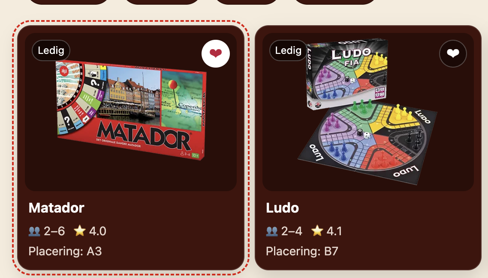

*Figur: Spillekortet kan efter optimeringen modtage en tydelig fokusmarkering ved navigation med tastatur.*

#### Fokus i modalvinduet

Da spillekortene kunne åbnes med Enter, blev det efterfølgende testet, hvordan fokus fungerede i modalvinduet. Her fortsatte fokus i første omgang videre til elementerne på siden bag modalvinduet.

Fokusstyringen er derfor ændret, så fokus automatisk flyttes til luk-knappen, når et spil åbnes. Herfra kan brugeren navigere videre med Tab til "Regler", som kan åbnes med Enter. Tab og Shift + Tab holder fokus mellem luk-knappen og "Regler", så brugeren ikke kommer til at navigere på siden bag modalvinduet.

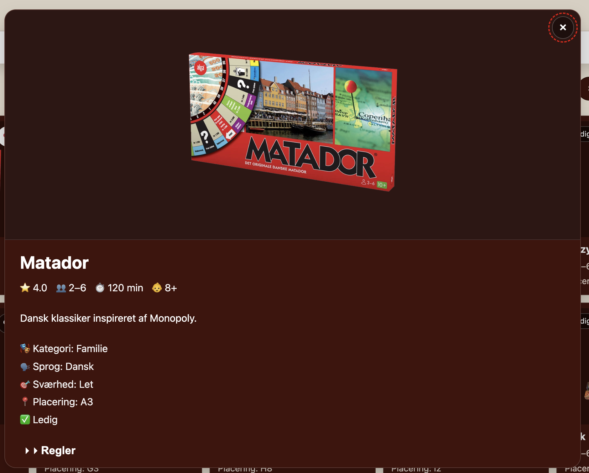

*Figur: Når et spillekort åbnes med Enter, flyttes tastaturfokus automatisk til luk-knappen i modalvinduet.*

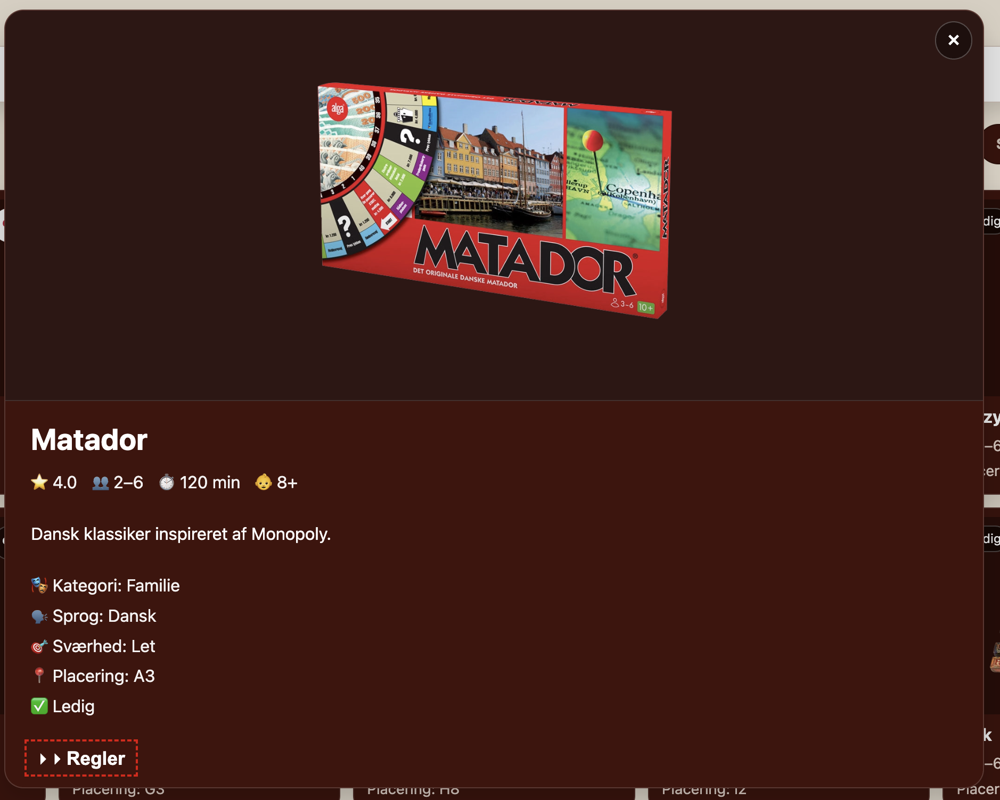

*Figur: Med Tab kan fokus flyttes fra luk-knappen til "Regler", som kan åbnes med Enter.*

Modalvinduet kan desuden lukkes med Escape. Når det lukkes, flyttes fokus tilbage til det spillekort, som brugeren åbnede. Brugeren kan dermed fortsætte sin tastaturnavigation fra samme sted.

#### Test

Efter optimeringen er funktionen testet med Tab, Shift + Tab, Enter og Escape. Testen viste, at spillekortene nu kan åbnes med tastatur, "Regler" kan åbnes med Enter, fokus holdes inde i modalvinduet, og fokus returnerer til det valgte spillekort efter lukning.

### Tastaturbetjening af filtre

Keyboard-testen fra delaflevering 1 viste, at filterknapperne kunne modtage fokus med Tab, men dropdown-menuerne kunne ikke åbnes med tastaturet. Det betød, at brugere, der navigerer uden mus, ikke kunne anvende filtreringen.

#### Optimering

Dropdown-menuerne er derfor gjort mulige at betjene med tastatur. Der er tilføjet en `keydown`-event i JavaScript, som registrerer, når brugeren trykker Enter på en filterknap.

Hvis dropdownen er lukket, åbnes den, og fokus flyttes automatisk til den første valgmulighed. Hvis dropdownen allerede er åben, lukkes den igen med Enter.

```javascript
// Gør det muligt at åbne og lukke dropdowns med Enter.
row?.addEventListener("keydown", (e) => {
  const pill = e.target.closest(".filter-dropdown .pill");
  if (!pill || e.key !== "Enter") return;

  e.preventDefault();

  const dd = pill.closest(".filter-dropdown");

  if (openDD === dd) {
    closeDropdown();
  } else {
    openDropdown(dd, pill);

    // Flytter fokus til den første valgmulighed i den åbne dropdown.
    const firstOption = floatingMenu?.querySelector("button");
    firstOption?.focus();
  }
});
```

Den samme funktion anvendes på de forskellige filter-dropdowns, så der ikke skal laves separat tastaturstyring til hvert filter.

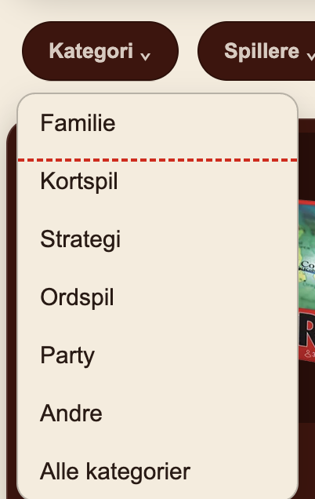

*Figur: Dropdown-menuen er åbnet med Enter, hvorefter fokus automatisk flyttes til den første valgmulighed.*

#### Fokus i den åbne dropdown

Ved test af den første løsning blev det observeret, at fokus kunne fortsætte videre til andre elementer på siden, selvom dropdown-menuen stadig var åben. Fokusstyringen blev derfor tilpasset, så brugeren bliver i den åbne dropdown, indtil den enten lukkes eller der vælges en mulighed.

Når brugeren når den sidste valgmulighed med Tab, flyttes fokus tilbage til filterknappen. Ved navigation i den modsatte retning flyttes fokus ligeledes tilbage til filterknappen, når Shift + Tab anvendes fra den første valgmulighed.

```javascript
// Tab fra sidste valg går tilbage til filterknappen.
if (!e.shiftKey && currentFocus === lastOption) {
  e.preventDefault();
  filterButton.focus();
  return;
}

// Shift + Tab fra første valg går tilbage til filterknappen.
if (e.shiftKey && currentFocus === firstOption) {
  e.preventDefault();
  filterButton.focus();
  return;
}
```

Når fokus er tilbage på filterknappen, kan brugeren lukke dropdown-menuen med Enter. Først når dropdownen er lukket, går Tab videre til det næste filter.

Hvis brugeren vælger en valgmulighed med Enter, lukkes dropdown-menuen, og fokus flyttes tilbage til den filterknap, menuen blev åbnet fra.

```javascript
// Sender fokus tilbage til den dropdown-knap brugeren kom fra,
// når menuen er blevet lukket.
requestAnimationFrame(() => {
  activePill?.focus();
});
```

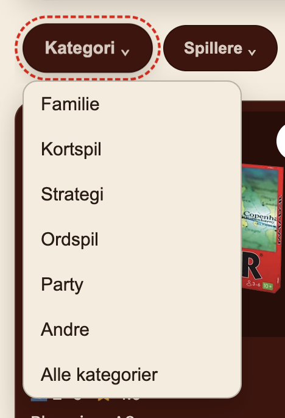

*Figur: Fokus er tilbage på filterknappen, mens dropdown-menuen stadig er åben. Herfra kan menuen lukkes med Enter, før brugeren navigerer videre.*

#### Test

Efter optimeringen er Kategori, Spillere, Alder og Varighed testet med Tab, Shift + Tab og Enter.

Testen viste, at alle fire dropdown-menuer nu kan åbnes og lukkes med tastatur. Brugeren kan navigere mellem valgmulighederne med Tab og Shift + Tab, og fokus bliver i den åbne dropdown, indtil brugeren vælger en mulighed eller lukker menuen.

Ved valg af en mulighed returnerer fokus til den tilhørende filterknap, så brugeren kan fortsætte tastaturnavigationen fra samme sted.

### Tastaturbetjening af booking og favoritter

Efter optimeringen af spillekort, dropdown-menuer og modalvindue blev tastaturnavigationen testet på de øvrige dele af løsningen.

På bookingsiden kunne caféerne i første omgang ikke modtage tastaturfokus, da de var opbygget som klikbare kort. Café-kortene blev derfor gjort fokusérbare og kan nu vælges med Enter.

Når bookingflowet åbnes fra bundnavigationen, flyttes fokus automatisk til den første café. Herfra kan brugeren fortsætte gennem bookingflowet med tastaturet og vælge blandt andet antal gæster, dato, tidspunkt og bookingtype.

Ved testen blev der samtidig fundet en fejl i bundnavigationen, hvor Favoritter ikke lukkede bookingvisningen. Navigationen blev derfor rettet, så brugeren kan skifte mellem de forskellige visninger med både mus og tastatur.

Favoritsiden anvender de samme fokusérbare spillekort som den almindelige spiloversigt og kan derfor også navigeres med tastatur.

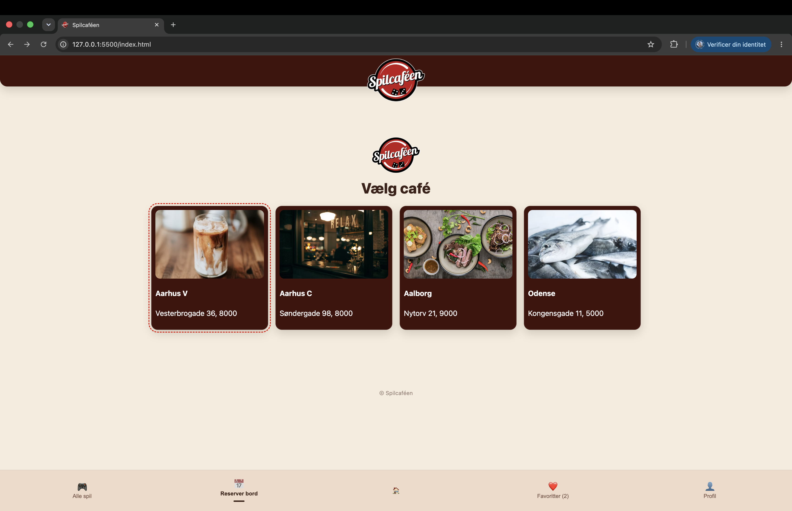

*Figur: Fokus flyttes til den første café, når bookingflowet åbnes med tastatur.*

### Keyboard-test efter optimering

Efter de enkelte ændringer blev keyboard-testen fra delaflevering 1 gentaget. Formålet var at undersøge, om de tidligere fundne problemer var blevet løst, og om løsningens centrale funktioner kunne gennemføres uden brug af mus.

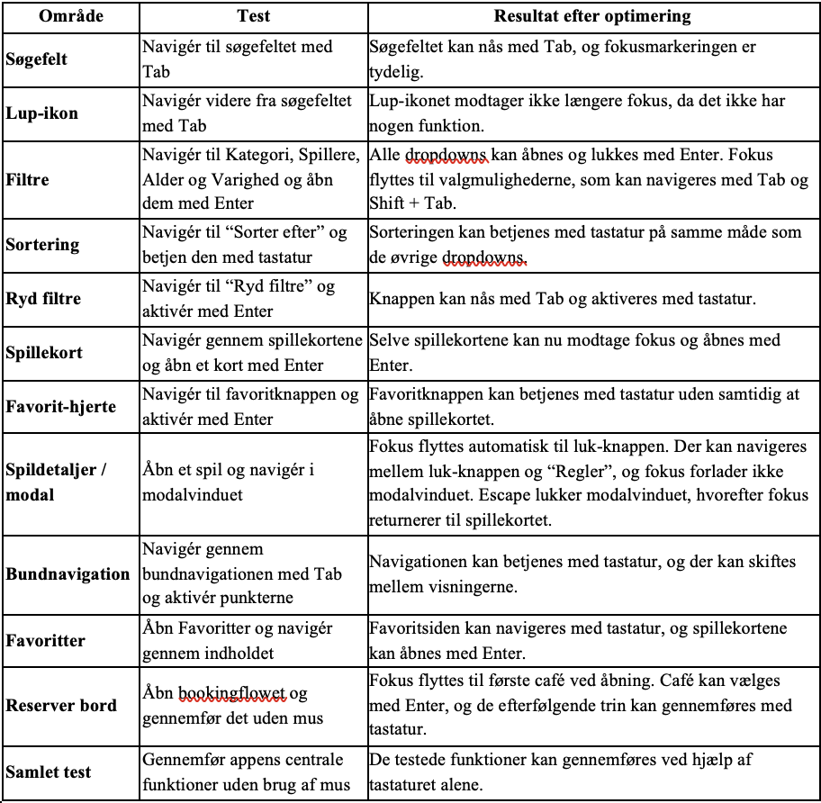

Testen viste, at de centrale funktioner, som tidligere gav problemer ved tastaturnavigation, nu kan betjenes uden brug af mus.

## Optimering til skærmlæser

I brugertesten fra delaflevering 1 blev der fundet flere problemer ved brug af skærmlæser. Der manglede blandt andet feedback ved handlinger som favoritter og rydning af filtre. Derudover skulle brugeren selv forsøge at navigere ind i dropdown-menuerne, efter de var blevet åbnet.

Derfor er der arbejdet med at gøre feedback og navigation tydeligere for skærmlæserbrugere.

### Feedback ved rydning af filtre

I brugertesten kunne skærmlæseren læse knappen "Ryd filtre", men efter aktivering kom der ingen feedback om, at filtrene faktisk var blevet ryddet.

#### Optimering

Der er tilføjet et skjult område med `aria-live="polite"`. Området er ikke synligt på siden, men gør det muligt at give skærmlæseren besked, når der sker en ændring.

```html
<!-- Giver skærmlæseren besked, når der sker en ændring. -->
<p id="filter-feedback" class="sr-only" aria-live="polite"></p>
```

Området skjules visuelt med CSS, men er stadig tilgængeligt for skærmlæsere.

```css
/* Skjuler indhold visuelt, men gør det stadig tilgængeligt for skærmlæsere. */
.sr-only {
  position: absolute;
  width: 1px;
  height: 1px;
  padding: 0;
  margin: -1px;
  overflow: hidden;
  clip: rect(0, 0, 0, 0);
  white-space: nowrap;
  border: 0;
}
```

Når "Ryd filtre" aktiveres, indsættes beskeden "Filtre er ryddet" i `aria-live`-området.

```javascript
// Giver skærmlæseren besked om, at filtrene er blevet ryddet.
const feedback = document.getElementById("filter-feedback");
if (feedback) {
  feedback.textContent = "Filtre er ryddet";
}
```

#### Test

Efter ændringen blev funktionen testet med VoiceOver på computer. Når "Ryd filtre" aktiveres, annoncerer VoiceOver nu "Filtre er ryddet", så brugeren får bekræftet, at handlingen er gennemført.


### Favoritter

I brugertesten manglede der tydelig information og feedback ved favoritfunktionen. Det var derfor ikke tydeligt for en skærmlæserbruger, om et spil kunne tilføjes eller fjernes fra favoritter, og der kom heller ingen bekræftelse efter handlingen.

#### Optimering

Favoritknappen har fået et dynamisk `aria-label`, som afhænger af, om spillet allerede er gemt som favorit.

```javascript
// Fortæller skærmlæseren, om spillet kan tilføjes eller fjernes fra favoritter.
const favLabel = FAVS.has(String(g.id))
  ? "Fjern fra favoritter"
  : "Tilføj til favoritter";
```

Det dynamiske label tilføjes til favoritknappen:

```html
<button class="fav ${favActive}" data-fav-id="${g.id}" aria-label="${favLabel}">❤</button>
```

Når et spil fjernes fra favoritter, ændres knappens `aria-label` til "Tilføj til favoritter". Samtidig bruges det tidligere oprettede `aria-live`-område til at give beskeden "Fjernet fra favoritter".

```javascript
if (FAVS.has(id)) {
  FAVS.delete(id);
  favBtn.classList.remove("active");
  favBtn.setAttribute("aria-label", "Tilføj til favoritter");

  // Giver skærmlæseren besked om, at spillet er fjernet.
  const feedback = document.getElementById("filter-feedback");
  if (feedback) {
    feedback.textContent = "Fjernet fra favoritter";
  }
}
```

Når et spil tilføjes til favoritter, ændres knappens `aria-label` i stedet til "Fjern fra favoritter", og skærmlæseren får beskeden "Tilføjet til favoritter".

```javascript
else {
  FAVS.add(id);
  favBtn.classList.add("active");
  favBtn.setAttribute("aria-label", "Fjern fra favoritter");

  // Giver skærmlæseren besked om, at spillet er tilføjet.
  const feedback = document.getElementById("filter-feedback");
  if (feedback) {
    feedback.textContent = "Tilføjet til favoritter";
  }
}
```

#### Test

Favoritfunktionen blev testet med VoiceOver på computer. Hvis et spil ikke er gemt som favorit, læser VoiceOver "Tilføj til favoritter". Efter aktivering gives beskeden "Tilføjet til favoritter".

Når spillet allerede er gemt som favorit, læser VoiceOver "Fjern fra favoritter". Efter fjernelse gives beskeden "Fjernet fra favoritter".

Brugeren får dermed både information om, hvad knappen gør, og feedback om resultatet efter handlingen.


### Eftertest af dropdown-menuer med skærmlæser

I den oprindelige brugertest oplevede brugeren, at hun selv skulle forsøge at navigere ind i dropdown-menuen efter åbning.

Fokusstyringen i dropdown-menuerne blev tidligere ændret i forbindelse med optimeringen af tastaturbetjeningen. Der er derfor ikke foretaget yderligere ændringer i dropdown-menuerne i denne del.

Dropdown-menuerne er i stedet blevet eftertestet med VoiceOver på computer. Når eksempelvis "Kategori" åbnes, flyttes fokus direkte til den første valgmulighed, som VoiceOver læser op.

Eftertesten viser dermed, at den tidligere ændring af fokusstyringen også afhjælper det problem, der blev observeret med skærmlæser i den oprindelige brugertest.


### Formularfelter uden labels

I delaflevering 1 viste testen med WAVE seks "Missing form label"-fejl. Fejlene blev blandt andet fundet ved søgefeltet samt felter til rating, spilletid og "Kun ledige".

I auditten blev løsningen vurderet til at være, at felterne skulle have meningsfulde `<label>`-elementer, som blev koblet sammen med felternes `id`.

Da problemet skulle optimeres, blev HTML- og JavaScript-koden gennemgået nærmere. Her viste det sig, at de seks fejl ikke skulle løses på samme måde.

#### Søgefelt

Søgefeltet er et synligt formularfelt, som brugeren kan interagere med. Feltet havde kun en placeholder med teksten "Søg", men ikke et tilknyttet `<label>`.

Derfor blev der tilføjet et label med `for="search-input"`, som passer til feltets `id="search-input"`.

```html
<!-- Giver søgefeltet et navn til skærmlæsere. -->
<label for="search-input" class="sr-only">Søg efter spil</label>
<input type="text" id="search-input" placeholder="Søg" />
```

Klassen `sr-only` gør, at teksten ikke er synlig i designet, men stadig kan læses af en skærmlæser.

Efter ændringen blev siden testet igen med WAVE. Antallet af "Missing form label"-fejl faldt fra **6 til 5**, hvilket viste, at fejlen ved søgefeltet var løst.

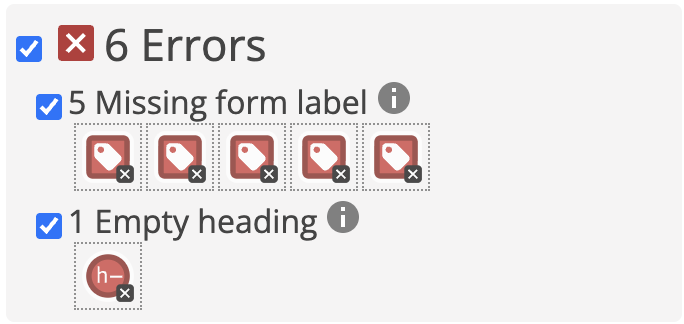
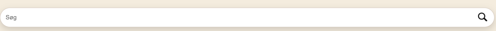

#### Oprydning af skjulte formularfelter

De resterende fem fejl kom fra følgende felter:

- `rating-from`
- `rating-to`
- `playtime-from`
- `playtime-to`
- `available-only`

Ved gennemgang af koden viste det sig, at disse felter lå i et skjult område og ikke kunne bruges af brugeren i den nuværende brugerflade. De var rester fra et tidligere filtersystem, men JavaScript indeholdt stadig kode, som hentede og behandlede deres værdier.

I stedet for at tilføje labels til felter, som brugeren ikke længere kunne benytte, blev de overflødige formularfelter derfor fjernet fra HTML'en. Den JavaScript, som kun var knyttet til disse felter, blev også fjernet.

Rating-oprydningen blev udført først. Herefter faldt antallet af "Missing form label"-fejl fra **5 til 3**.

Derefter blev de gamle felter til spilletid fjernet. Den nuværende filtrering efter varighed fungerer gennem dropdown-menuen "Varighed" og blev testet efter oprydningen for at sikre, at funktionen stadig virkede. Herefter var der **1 fejl tilbage**.

Til sidst blev det skjulte felt `available-only` og den tilhørende JavaScript fjernet, da "Kun ledige" heller ikke findes som en funktion i den nuværende brugerflade.

#### Resultat

Efter oprydningen blev siden testet igen med WAVE.

**Før optimering:** 6 "Missing form label"-fejl  
**Efter optimering:** 0 "Missing form label"-fejl

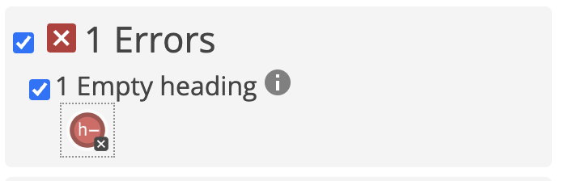

Søgning, filtrering, sortering og "Ryd filtre" blev samtidig testet efter ændringerne for at kontrollere, at oprydningen ikke havde påvirket de funktioner, der fortsat bruges på siden.

Optimeringen endte derfor med at være anderledes end først foreslået i delaflevering 1. Et label var den rigtige løsning til det synlige søgefelt, mens de øvrige fejl skyldtes overflødige skjulte formularfelter. Her var det mere relevant at fjerne den unødvendige kode end at tilføje labels til felter, som brugeren ikke kunne benytte.


### Redesign af siden "Alle spil"

Jeg har arbejdet videre med det visuelle design af siden "Alle spil". Formålet har været at gøre siden mere overskuelig og skabe et mere sammenhængende visuelt udtryk, samtidig med at den eksisterende funktionalitet bevares.

#### Visuelt design

- Den tidligere mørke header er fjernet.
- Logoet er placeret centralt øverst sammen med overskriften "Alle spil".
- Søgefeltet er redesignet, så det passer til det nye visuelle udtryk.
- Farver, knapper og afstande er tilpasset, så siden fremstår mere ensartet.
- Spilkortenes eksisterende opbygning er bevaret, men farverne er ændret, så kortene passer til det nye design.
- Emojis på spilkortene er erstattet med ikoner, så udtrykket bliver mere ensartet med resten af brugerfladen.
- Bundnavigationen er visuelt tilpasset det nye design.

Formålet med de visuelle ændringer er at skabe en tydeligere sammenhæng mellem sidens elementer og gøre brugerfladen mere rolig og overskuelig.

#### Filter og sortering

De tidligere separate filtre er samlet under én "FILTRE"-knap. Herfra kan brugeren fortsat filtrere spillene efter kategori, antal spillere, alder og varighed.

Jeg valgte at samle filtrene, fordi de tidligere optog meget plads og gjorde området omkring filtreringen uoverskueligt. Ved at samle dem under én knap fylder filtreringen mindre, mens de eksisterende filtermuligheder stadig er tilgængelige.

"Sorter efter" er fortsat placeret separat, da sortering ændrer rækkefølgen på spillene og derfor har en anden funktion end filtrering. "Ryd filtre" er placeret som en mindre knap under sorteringen.

Knapperne er visuelt tilpasset hinanden og har fået samme enkle hover-effekt.

#### Funktionalitet efter ændringerne

Efter opbygningen af filterområdet blev ændret, blev JavaScript tilpasset, så filtreringen fortsat fungerer med den nye menu.

Jeg har efterfølgende testet:
- søgning
- de forskellige filtre
- sortering
- ryd filtre
- åbning af spilkort
- favoritter
- bundnavigation

Funktionerne virker fortsat efter ændringerne.

#### Responsivt design

Det tidligere optimerede mobile layout med to spilkort pr. række er bevaret. Den nye filtermenu er tilpasset mindre skærme, så undermenuerne vises under hinanden frem for ud til siden.

Jeg har kontrolleret siden i mobilvisning for at sikre, at det nye design og filtermenuen fortsat fungerer på mindre skærme.

#### Eftertest med VoiceOver

Efter ændringerne testede jeg siden med VoiceOver for at kontrollere, at funktionerne fortsat kunne forstås og betjenes med skærmlæser.

Søgefelt, filtrering, sortering, ryd filtre og navigation fungerede med VoiceOver.

Under testen opdagede jeg dog, at VoiceOver kunne fokusere på spilkortene, men ikke fortalte, hvilket spil det enkelte kort repræsenterede. Derfor tilføjede jeg spillets titel som `aria-label` på kortet.

Jeg tilføjede også `role="button"`, da hele spilkortet kan aktiveres for at åbne information om spillet. Efter ændringen læser VoiceOver spillets navn op og fortæller, at elementet fungerer som en knap.